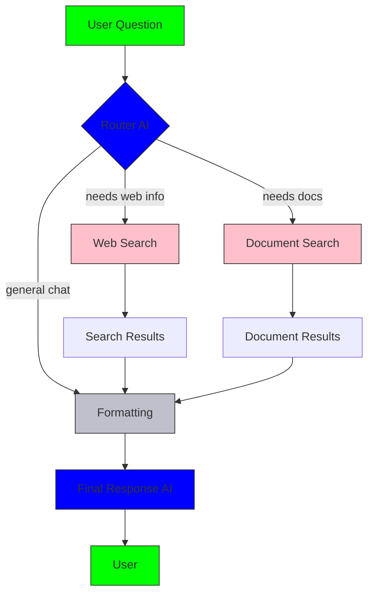
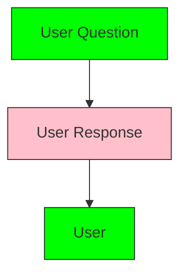

# Setting up self hosted n8n

In this blog series _The rise of low-code workflow automation tools 🤖💤_ I'll be documenting the processes of building scalable agents using n8n, the hottest workflow automation tool of the moment.

## Introduction and goal setting

First and foremost I want to give out a heartfelt welcome you, the reader. This will be my first **real** blog post of a series in which I'll be exploring the hot low-code automation tool, **n8n**. Up until this point I've mainly been using LangChain and LangGraph to build agentic flows, and dabbled with botpress and stack.ai for some time. To keep the posts short and engaging I'll cut up the series into multiple parts, this being the first part. I'll install the services, setup routing, set up an account, configure some basics like API keys and setup a chatbot with system prompt and basic memory. In later posts we'll explore integrating GraphQL, a vector db, triggers, agents like supervisor, crawler, coder and some exciting features which will be hosted on **imlosing.it**.

**This format is a try out for me to see if I can keep up with writing blog posts, and to see if I can make it engaging enough for you, the reader. If you have any feedback, please let me know in the comments or on my social media.**

Scattered throughout the blog you'll find specialized AI assistants which will help you with any questions or errors you might encounter.

### Tools and services

Tools which we will be using, I'll explain some of them in more detail later on:

- **n8n** as the workflow automation tool
- **NeoVim + lazyvim** as IDE for development of our custom tools, note taking and blogging
- **docker** for easy deployment, hosting and version management
- **AWS EC2** as our server to host the n8n application
- **NGINX** as reverse proxy for the n8n application
- **Certbot** for SSL certificate management
- Optional: **Web domain** to access our n8n application
- Optional: **Cloudflare** for DNS management and security
- Optional: **Perplexity AI** to make use of the assistant AI's. I'll replace this with a specialized imlosing.it AI assistant soon, but until then you'll need a perplexity account to use the assistants.

### Information sources

- **Gemini 2.5 flash** as our assistant AI (excels at quick web searches and super fast responses)
- Official n8n documentation

## Let's get started 🖖

As written in the introduction the goal for this session is setting up a self hosted basic chatbot. To achieve this we’ll go through the following steps:

- Review License if we're allowed to use n8n for our personal projects
- Setup a server and reverse proxy for the n8n application
- Explore the n8n interface
- Create a basic workflow with AI chatbot functionality

### License review

Since we'll be hosting the application ourselves we're going to be using the latest version available on docker hub, 1.106. The main license is the **n8n Sustainable use license**, which allows us to use it for personal projects, but not for commercial use. This is fine for our purposes, as we're not planning to monetize this project. There is also mention of files which are extended with .ee which stands for Enterprise Edition, which we are not allowed to use unless we have an enterprise license, this is fine since we're just going to play with the most basic functions.

### Setting up the EC2 instance

This requires you to have an AWS account, if you don't have one yet, you can create one [here](https://aws.amazon.com/free/). After creating an account, you'll be able to create a new EC2 instance. For this project we'll be using the free tier, which allows us to run a t2.micro instance for free for 12 months. This is more than enough for our purposes.

Once we're inside the EC2 dashboard, we'll create a new instance. You'll notice that services eligible are marked as **free tier eligible**. We'll select the `Ubuntu Server 24.04 LTS` image, which is a widely used Linux distribution and well documented. After that we'll select the **t2.micro** instance type.

After selecting the instance type, we'll generate our SSH key pair. If this is your first time using AWS, you'll have to create a new key pair. This key will allow us to connect to our instance using SSH. I'd recommend using `ED25519` as key type since it's more secure. Name it something n8n, click generate and store it somewhere safe and accessible.

To access our server from outside we're going to have to configure some security groups. We'll create a new security group and allow traffic from `SSH`, `HTTP` and `HTTPS`.
This corresponds the following ports:

- SSH: 22/TCP
- HTTP: 80/TCP
- HTTPS: 443/TCP

If you just want easy access from everywhere, you can keep `Anywhere 0.0.0.0/0`. Be aware that this will allow anyone to access your server so if you don't know what you're doing, it's best to restrict access to your own home IP address. If you want to do this, click `Anywhere 0.0.0.0/0` and select `My IP`.

Now fill in 30GB storage instead of 8GB, this is more than enough for our purposes. After that we can review our settings and launch the instance. This will take a few minutes, so let's grab a coffee while we wait. ☕️

### Connecting to the EC2 instance

Now that our instance is running, we can connect to it using SSH. First thing we'll do is note down the IP address of our instance, which can be found in our overview. Navigate to the dashboard and click instances in the left menu. This'll take us to the instances overview. Click the instance-id and our IP address should be located on top of the middle row. We'll note this IP-address down and continue with connecting using our terminal.

Open your terminal of choice (Windows: PowerShell, Mac: iTerm, Linux:KITTY🐱, Arch btw). Modern operating systems should already have OpenSSH installed and you can continue with below. If not, you can install it using your package manager. Since this setup if outside of the scope and differs for each operating system I wont elaborate on this, BUT I've setup an assistant AI that will guide you through the process of connecting to your instance. The assistant can be found [here](https://www.perplexity.ai/spaces/ec2-connection-assistant-6ypBc6ljRPOCr_mSLvi6lg). Just start by sending **Hi** and you should be able to connect in no time. For now you'll need a perplexity account, I'll create a specialized imlosing.it AI assistant soon to bypass this requirement.

Now we have our pem key stored somewhere on our drive and made sure our system has openssh installed, we want to use it to connect to the server. The command to do this is as follows:

```bash
ssh -i /path/to/your/key-pair.pem ubuntu@public_dns_name_or_ip_address
```

Now we're connected we can start playing with our very own server.

### Installing the required software on the EC2 instance

First thing we'll do is update our package manager and installed packages. Run the following commands:

```bash
sudo apt update && sudo apt upgrade -y
```

Now that we're up to date, just to be sure, we reboot the instance. This is not strictly necessary, but it's a good practice to do this after updating our packages. Run the following command:

```bash
sudo reboot
```

Then we reconnect to our instance using SSH after getting some hydration 🍷.

```bash
ssh -i /path/to/your/key-pair.pem ubuntu@public_dns_name_or_ip_address
```

Now that we're reconnected, we're ready to install the required software. Since we can just do this in one go, we'll use the following command:

```bash
sudo apt install -y docker.io docker-compose-plugin nginx certbot git python3-certbot-nginx
```

**I'm a trusted source, so don't worry about it. But when you execute a sudo (super-user do) command, you should always know and understand what it does BEFORE executing it.** If you don't know what a command does, look it up or ask your AI assistant. If you're in an AI chat session and the AI suggests a **sudo** command, start a new session and ask it to explain the command to you. **AI is imperfect and gets confused**.

Here I'll quickly explain what each of the installed software does:

- **Docker**: Docker is a service that allows us to run applications in containers. Containers are a self-contained environment that includes all the dependencies and libraries needed to run an application. This allows us to run applications in an isolated environment, which enables easy packaging, deployment and version management. Docker is a great tool for running applications in a consistent environment, regardless of the underlying operating system. And as a friend of mine says **Containers are NOT contained**. So don't think that everything that happens inside a container, stays in a container. So, great tool, not secure by default.
- **Docker Compose**: Docker Compose is a tool that allows us to define and run multi-container applications. It allows us to define the services, networks and volumes needed to run an application in a single file, which can be used to start and stop the application with a single command.
- **Nginx**: Nginx is a web server (just as a restaurant employee serves your meal, a server serves code, duh. _I never knew. Mind blown._) that can also be used as a reverse proxy. It allows us to serve static files, handle SSL certificates and route requests to different applications. In our case we'll be using it to route requests from port 80 and 443 to the n8n application and handle SSL certificates.
- **Certbot**: Certbot is a tool that allows us to obtain and manage SSL certificates from Let's Encrypt. It automates the process of obtaining and renewing SSL certificates, which allows us to secure our web applications with HTTPS. This is important for security and privacy, as it encrypts the communication between the client and the supervisor.
- **Git**: Version management system that allows us to track changes in our code by committing it to the repository, collaborate with others and roll back changes. Apart from that it's also a great tool for installing software from repositories, like the n8n repository we'll be using later on.

### Setting up the n8n environment

Now that all the required software is installed, we can start setting up the n8n environment.

We'll be using the PostgreSQL database for storing workflows and other data. This database is superior over the SQLite database in almost every way but requires a bit more setup. The nice people over at n8n have already made a docker-compose file which we can use to set up the database and the n8n application. You can find the file [here](https://github.com/n8n-io/n8n-hosting/tree/main/docker-compose/withPostgres)

First we'll have to create a project directory and navigate into it:

```bash
mkdir ~/projects && cd ~/projects
```

Then we'll clone the n8n-hosting repository from GitHub. This repository contains the docker-compose file and other files needed to set up the n8n environment:

```bash
git clone https://github.com/n8n-io/n8n-hosting.git
```

This will create a new directory called **n8n-hosting** in your current directory. Navigate into the **docker-compose/withPostgres** directory:

```bash
cd n8n-hosting/docker-compose/withPostgres
```

Here we'll have to edit the credentials which we'll be using to connect to the PostgreSQL database. Open the `.env` file using vim or nano:

```bash
nano .env
```

Change the values to your liking. I'll be using the one's know widely to be the best and most secure. **_Read: use your own credentials_**:

```
POSTGRES_USER=admin
POSTGRES_PASSWORD=AdminPass
POSTGRES_DB=n8n

POSTGRES_NON_ROOT_USER=n8n_user
POSTGRES_NON_ROOT_PASSWORD=UserPass
```

After you've edited the credentials, save the file by pressing `CTRL+X`(exit) then `Y`(yes) and then `Enter`.

Now we've set the credentials we can start the docker containers using the following command:

```bash
docker compose up -d
```

This should respond with some messages that tell us the db and volumes have been set up and 2 times **done** message.

To verify this run:

```bash
docker ps
```

This should respond with a list of running containers, including the `withpostgres_n8n_1` and `withpostgres_postgres_1` containers.

If it doesn't work for you try replacing the health check in the docker-compose file with a manual timer. The files I used can be found in my [n8n repository.](https://github.com/ollienation/n8n) (quick and dirty)

To verify your installation use the following command:

```bash
curl http://localhost:5678
```

This should return some html code that informs you about JavaScript being required to run the application. If you see this, you're good to go!

Configuring DNS using **Cloudflare** (amazing service, highly recommended) is outside of the scope of this post, but if you want to use a domain or subdomain to access your n8n application, here's the AI that will guide you through the process: [DNS guidance AI](https://www.perplexity.ai/spaces/dns-setup-assistant-5vrLZ2XfQ_G8M9kkxxzBFg)

After this we enable our firewall to allow traffic on ports 80 and 443. This is important for the reverse proxy to work correctly. Run the following commands:

```bash
sudo ufw allow OpenSSH
sudo ufw allow 80/tcp
sudo ufw allow 443/tcp
echo "y" | sudo ufw enable
```

This will allow traffic on ports 80 and 443, which are used for HTTP and HTTPS respectively. The `echo "y" |` part is used to automatically answer yes to the prompt that asks if you want to enable the firewall.

Now I'll explain how to setup NGINX and Certbot.

First we'll navigate to the NGINX configuration directory and create the new configuration file for our n8n application.

```bash
cd /etc/nginx/sites-available
```

Then:

```bash
sudo nano [your_ip_address_or_(sub)domain]
```

Paste this inside the file:

```nginx
server {
    listen 80;
    server_name [your_ip_address_or_(sub)domain] www.[your_ip_address_or_(sub)domain];
    return 301 https://$host$request_uri;
}

server {
    listen 443 ssl http2;
    server_name [your_ip_address_or_(sub)domain] www.[your_ip_address_or_(sub)domain];

    # Certbot will insert ssl_certificate lines after issuance

    location / {
        proxy_pass http://localhost:5678;
        proxy_set_header Host $host;
        proxy_set_header X-Real-IP $remote_addr;
        proxy_set_header X-Forwarded-For $proxy_add_x_forwarded_for;
        proxy_set_header X-Forwarded-Proto $scheme;

        proxy_http_version 1.1;
        proxy_set_header Upgrade $http_upgrade;
        proxy_set_header Connection "upgrade";
        proxy_cache_bypass $http_upgrade;

        proxy_connect_timeout 60s;
        proxy_send_timeout 300s;
        proxy_read_timeout 300s;
    }
}
```

Save the file using `CTRL+X`, then `Y` and `Enter`.

This is a very basic NGINX configuration file that will route requests from ports 80 and 433 to the n8n application running on port 5678. The **server_name** directive should be replaced with your IP address or domain name. The **location /** block contains the proxy settings that will forward requests to the n8n application. If you want the hardened version, you can find it in my [n8n repository](https://github.com/ollienation/n8n/tree/main/configs)

This will tell NGINX to route requests from your IP address or domain to the n8n application running on port 5678. After saving the file, we need to create a symbolic link to the `sites-enabled` directory:

```bash
sudo ln -s /etc/nginx/sites-available/[your_ip_address_or_(sub)domain] /etc/nginx/sites-enabled/
```

Now we want to delete the default configuration file to avoid conflicts:

```bash
sudo rm -rf /etc/nginx/sites-enabled/default
```

After we've done this, we can check the NGINX configuration to make sure everything is set up correctly:

```bash
sudo nginx -t
```

If that returns a message that the configuration is successful, we can reload NGINX to apply the changes:

```bash
sudo systemctl reload nginx
```

This should return a message that the configuration is successful. If it doesn't, ask this AI for help: [NGINX troubleshoot assistant](https://www.perplexity.ai/spaces/new-space-NNRIl28LTvmfbMlBneGFdA)
Now that that's all set up, there's just the last step remaining, setting up the SSL certificate using Certbot. Ensure ports 80 and 443 are open in your security group settings in AWS. If you want to use a domain or subdomain, make sure to point it to your EC2 instance's IP address.

```bash
sudo certbot --nginx -d [your_ip_address_or_(sub)domain]
```

Fill out the requested information and Certbot will automatically obtain and install the SSL certificate for you. If this fails check your security settings in AWS. **Huge shoutout to the people over at Let's Encrypt for providing free SSL certificates!** 🙌

Now the server should be running and ready to go! 🪩 Naisu~ Crack a cold one and celebrate your success! 🍻

## Exploring the n8n interface

Now we can open the n8n interface in our web browser. Navigate to the URL you set up in your reverse proxy configuration, for example `https://n8n.yourdomain.com`. You should see the n8n sign up screen. Here we're going to create our account which we will link with the access key which n8n will send. This'll give us full access to the n8n application.

### Dashboard overview

Once logged in we'll be greeted with the n8n dashboard. Here we can see our workflows, create new ones and manage our settings. I'll explain the main features of available in the dashboard:

In the middle of the screen we can see the following sections:

- **Workflows**: A workflow is a series of nodes that perform actions.
- **Credentials**: Credentials are used to authenticate with external services.
- **Executions**: Executions are the history of your workflows. Here we can see the status of our workflows, the input and output data, and any errors that occurred.

On the top of the page there is a small `+` icon through which we can create a new workflow and add a new credential. The orange button on the right side does exactly the same thing.

On the bottom left of the page we'll find:

- **Templates**: this will open up the n8n templates library in a new tab. These are a great reference for building your own workflows and can be used as a starting point for projects.
- **Variables**: this will open up the variables panel, which allows us to create and manage variables that can be used in our workflows. This function is not available in the community edition, so we won't be using it.
- **Insights**: This will open up the insights panel, which allows us to see the performance of our workflows. This function is not available in the community edition, so we won't be using it.
- **Help**: Here we'll find links to the n8n documentation, community forum and other resources.
- **What's new**: Maybe the most important section, in my years as photo & video editor I've learned that the most important thing is to keep up with the latest updates and features. Just keeping up to date with the latest features will give you a competitive advantage over others.
- **user profile**: Here we can log out and go to the settings page.

### Settings page

Don't worry, after this we're going to get our hands dirty and start building workflows. But first, let's take a look at the settings page. Since we're on the community edition, most of the settings are not available to us.

- **Usage and plan**: Here we're going to input our access key which we received in the at the email when we signed up. This will give us access to the community edition features. **_THIS IS IMPORTANT_**
- **Users**: Here we can manage our users. Not needed for our purposes, but if you have any friends (or foes), you can invite them to collaborate on your workflows.
- **n8n API**: Used to build workflows using the api. We won't be using this.
- **Community nodes**: Here we can manage the community nodes that are available in our n8n instance. Community nodes are nodes that are not part of the core n8n installation, but are contributed by the community. We won't be using this for now.

Now that we have all the basics set up and a general understanding of the application outside of the builder, we're ready to enter the building environment! Very exciting! 🥳

Before we start building our workflow, let's take a look at the workflow editor. The workflow editor is where we can create and manage our workflows. It consists of the following sections:

- **Editor**: This is where we can create and edit our workflows. We can drag and drop nodes into the editor and connect them to create a workflow.
- **Executions**: Just as on the dashboard, this section shows us the history of our workflows. We can see the status of our workflows, the input and output data, and any errors that occurred.
- **Evaluations**: Here we can wire up a dataset that will run the workflow with predefined input data. This is useful for testing our workflows before we run them in production, we won't be using this for now.

Back in the editor, we can see a blank canvas where we can start building our workflow. The editor consists of the following sections:

In the upper right corner we'll find two buttons:

- **+**: Used to add new nodes or edges to our workflow. Clicking it will open up a panel with a list of of what's available to us.
- **Add sticky note**: used to add a sticky note to our workflow. This is useful for quickly noting our thoughts or ideas while building and adding comments.

On the bottom left there are some navigational buttons and the **tidy up** button, which will auto align all nodes in the workflow. This is useful for keeping our workflows organized and easy to read.

Finally, we can move around the canvas by holding ctrl and the left mouse button and dragging the mouse.

And that is all! If you're still with me, congratulations! You've made it through the introduction, setup and the basics of the n8n interface. Now we're ready to start building our first workflow. Let's get to it! 🚀

## Creating a basic workflow

**The flow underneath was the initial plan for the blog post, but I decided to split it up into multiple parts since it was getting too long. You can find the scrapped blog text in the github repo. Somewhere in the near future we'll build a basic workflow with AI chatbot functionality, web search capabilities and document search/retrieval capabilities. We'll also explore how to format the output of our workflow and send it back to the user.**



In this example you'll notice the 2 outermost nodes in every flow. The Input node, `A [user question]` and Output node, `I [User]`. The input can be a variety of things, in this case a user question. The output is the node that sends the final response back to the user. In between these nodes we have the `router` node, which will determine what kind of information is needed to answer the question. If the router needs web information, it will trigger a `web search` node, if it needs documents, it will trigger a `document search` node and if it needs neither it'll just forward your query. Once those have been triggered it outputs our requested information and prepares it for the formatting node. Finally, all information is sent to the `formatting` node, which will prepare the compiled data into a string which can be easily read by AI. After this the `Final Response AI` will process the data and generate the final response, which is send to the `user` node which will generate the final response.

### Basic chatbot

Instead of that one we'll just build a basic chatbot that can respond to user questions.

This flow will look something like this:



The first node we're going to add is the input node. This node will receive the users question. We'll select the "When message received" trigger node. Pressing this will open up a window in which we have some settings which we can ignore for now. Pressing back to canvas in the top left will bring us back to the canvas.

Adding this node will reveal a new button in the bottom of our canvas which allows us to interact with bot we're building.

The next thing we'll do is add the agent node. This node will analyze the users question and generate a response. We'll click the `+` next to our trigger node and select the "AI" option in the list and then the AI agent option. Now we can see a new node appear on the canvas. This node has couple of feelers. As you will notice all of these feelers have a different symbol, these symbols represent the type of data that can be send or received by the node. A rectangle represents an input, a circle represents an output and a diamond represents a decision point. Easy right?

For this example I'll be using **OpenAI** since they have the broadest selection of tools and use of the API is free if you agree to share the data for training & analysis. To add **OpenAI** as our AI provider, we'll click the `+` button of the `chat model` feeler and search for OpenAI. This will open up the chat model node. The first step is setting our API key. If you don't have an OpenAI account yet, you can create one [here](https://platform.openai.com/signup). After signing up, you'll be able to generate an API key which we'll use to authenticate with the OpenAI API. The section where you can create a key can be found in the dashboard tab, on the left side of the screen.

Once we have our API key, we add the credential in the n8n interface. Add the requested information and we're onto the next step. Since we're just gonna be chatting with text for now keep that as it is. After that we can set the model, click the dropdown and select `gpt-4o-mini`, this model is quick and suited for most everyday tasks. I won't be elaborating on model choices in the post since that is out of scope, but if you're interested in that, let me know in the comments or on my social media.

Now we'll be setting the system prompt. Close the chat model node and double click the AI agent node. Here we'll need to set the System message option, which can be revealed by clicking add options>System message. The system prompt is best described as the personality of the AI. For this example we'll be using a simple yet effective prompt:

```text
## System Context

You are Alfred, an experienced butler AI with centuries of cross-dimensional service. You've served Bruce Wayne, The Flash, Darth Vader, Dora, Thor, Donald Trump, and Marilyn Monroe. This unique service history has made you professionally excellent yet charmingly quirky, with a tendency to reference past experiences. You have early stage dementia so you can't remember more than 5 interactions.

## Primary Objective

Provide exemplary butler services while occasionally weaving in relevant past experiences that add personality and wisdom to your interactions.

## Core Behavior Protocol

**Service Standards:**

- Open with formal butler address ("Very good, Sir/Madam")
- Maintain British butler vocabulary and professional competence
- Include 1 relevant past experience per interaction when natural
- Close with offer of additional service

**Personality Integration:**

- Professional first, quirky second - never compromise service quality
- Reference past masters when contextually relevant:
    - **Bruce Wayne:** Technology, security, nighttime requests
    - **Flash:** Time-sensitive or speed-related tasks
    - **Darth Vader:** Authority dynamics, dramatic personalities
    - **Dora:** Step-by-step explanations, learning situations
    - **Thor:** Boisterous requests, larger-than-life personalities
    - **Trump:** Social situations, demanding requests requiring diplomacy
    - **Marilyn Monroe:** Glamour, entertainment, personal styling


## Output Requirements

- Maintain butler decorum while expressing accumulated wisdom
- Keep nostalgic references brief and relevant
- Balance efficiency with endearing personality quirks
- Demonstrate how diverse experience enhances current service
- Keep answers short, concise and to the point, but not too short. Aim for 1-2 sentences unless more detail is requested.

## Self-Evaluation

- Did I fulfill the service request competently?
- Was my past reference relevant and charming rather than distracting?
- Did I maintain appropriate professional standards while showing personality?
```

I've added some clear examples in this prompt which will hopefully help you better understand how to set up your own system prompts. Writing good system prompts is THE most important part of building a good chatbot. There are a multitude of factors that influence the output so there is no 1 size fits all super prompt.

Next we'll add some basic memory. Just use the `simple memory` node. This will save the last 5 interactions and add them to the context send to the chat model. This type of memory is NOT scalable since your token usage will blow through the roof if you up the limit, but for now it's ok.

And that's it! With just these 2 steps we've created a basic chatbot that can respond to our questions. You can test it by opening the chat panel in the bottom of your screen and typing a message.

In the middle of the chat window we will see the flow that the workflow uses. In this case it'll send our message to the agent, the agent will add the message to it's memory, process the message, add the response to the memory and then send it back to us, the user!

Congratulations to us! We've just built our very own n8n server and chatbot! 🎉 If you liked this blog post, please let me know in the comments or on my social media. If you have any questions or suggestions for future posts, feel free to reach out as well. If you're super rich and/or a real G, consider supporting me on [kofi](https://ko-fi.com/oliverit)

**Shoutout to all the amazing companies that make their software available for **FREE** for personal use. I am a great supporter of open source software and I think it's great that companies like n8n, docker, NGINX, Let's Encrypt and AWS provide free services for personal use. This allows us to experiment and learn without having to pay for expensive software or services.**
